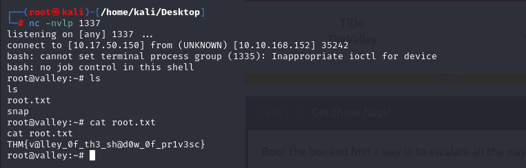

# Hi, I'm Dr4ks! 👋

## 🚀 About Me
I'm a Cyber Security student.

## 🔗 Links

## 🛠 Skills
Pentesting

# Valley Writeup
As you provided keypoints to solve this easy CTF on below and our keywords are 'security','pentest','boot2root' and 'enum'

You can access to this room on Tryhackme by provided link.
Room Link=>(https://tryhackme.com/room/valleype)

Our IP address=> 10.17.50.150
Target's IP address=> 10.10.56.70

## Content of Writeup

- [Enumeration](#enumeration)
- [What FTP have](#what-ftp-have)
- [Wireshark Analysis](#wireshark)
- [user.txt](#usertxt)
- [Linux Enumeration](#linux-enumeration)
- [root.txt](#roottxt)

# Enumeration
From nmap scanning, we need to take into consideration that we have 'POST' HTTP method for port 80. And we also see the FTP on port of 37370.

After we enumerate the website, we found that there is file 'note.txt' says like this.

We do enumeration for 'static' directory and found like this.

From here, we found the login page and let's dive into source code of this page. We got some credentials

username=siemDev
password=california

After entering credentials, we read file 

# What FTP have
As you see from above that, there is statement that '-stop reusing creds'.
So we just use previous username and password for port 37370 on FTP server.

From FTP, we just see pcapng files.

# Wireshark
We use Wireshark tool to analyze these files.
Let's start with file of siemHTTP2.pcapng 

As we know from enumeration part that there is 'POST' method is allowed.
We just search this request method.

username=>valleyDev
password=>ph0t0s1234

# User.txt
After using these credentials, we can read  user.txt file on 'valleyDev'

# Linux Enumeration
We go to home directory and there is file called "valleyAuthenticator" as this file **executable**,
we need to read this file by using 'strings' command as because 'cat' gives misunderstandable result.

From here, on 11896 and 11897 lines are hashed credentials for us let's decrypt them.

username=>e6722920bab2326f8217e4bf6b1b58ac=>liberty123
password=>dd2921cc76ee3abfd2beb60709056cfb=>valley

# Root.txt
After entering to valley account using above credentials, we just enumerate Linux again to privilege escalation.

And we just look at 'etc/crontab' to look at the cron jobs.
Here's the result, there is python file 'photosEncrypt.py' which uses file 'base64'.

Now, it's time to search write mode that we just add our **reverse shell**.

We find our writable file (base64.py) to add reverse shell by using 'find' command as below.

Let's add our reverse shell into this file.

Finally, we finished CTF by reading root.txt file

## Authors
- [@dr4ks](https://www.github.com/Dr4ks)